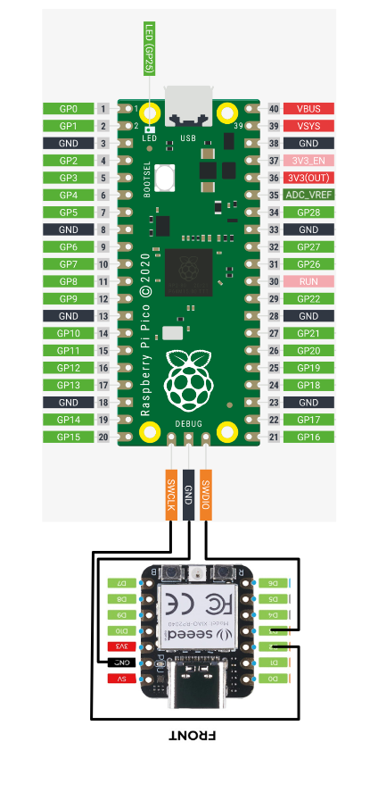

# RP2040

The Raspberry Pi Pico is a  high-performance microcontroller chip designed by Raspberry Pi in the United Kingdom

The Chip features 

- Dual-core Arm Cortex M0+ processor, flexible clock running up to 133 MHz
- 264kB of SRAM, and 2MB of on-board flash memory
- USB 1.1 with device and host support
- Low-power sleep and dormant modes
- Drag-and-drop programming using mass storage over USB
- 26 × multi-function GPIO pins
- 2 × SPI, 2 × I2C, 2 × UART, 3 × 12-bit ADC, 16 × controllable PWM channels
- Accurate clock and timer on-chip
- Temperature sensor
- Accelerated floating-point libraries on-chip
- 8 × Programmable I/O (PIO) state machines for custom peripheral support

## 

# SWD Debugging the RP2040

To allowing porting the nanoFramework to the RP2040, a native C/C++ debugging facility is required. ( *unless you can write perfect code*)

There a couple of ways to do this, the following describes the **Picoprobe** method.

For the complete description you can find the relevant information in the documentation at [Getting started with Raspberry Pi Pico](https://datasheets.raspberrypi.com/pico/getting-started-with-pico.pdf) in **Chapter 6. Debugging with SWD** and the **Appendix A: Using Picoprobe**.

The complete official Picoprobe source can be found at GITHUB.

At the time of starting the porting of the native C/C++ code for nanoFramework to the RP2040 I had the following two boards, the official Pico board and one from Seeed the XIAO RP2040. I decided to use the [Seeed XIAO RP2040](https://core-electronics.com.au/seeed-xiao-rp2040-supports-arduino-micropython-and-circuitpython.html) board as the picoprobe which only uses a couple of pins.

After downloading the code from  [GitHub - raspberrypi/picoprobe](https://github.com/raspberrypi/picoprobe), I made some modifications to the picoprobe_config.h file to match the GPIO ports I have chosen to connect to the SWD debugging port.

```csharp
// PIO config
#define PROBE_SM 0
#define PROBE_PIN_OFFSET 28
#define PROBE_PIN_SWCLK PROBE_PIN_OFFSET + 0
#define PROBE_PIN_SWDIO PROBE_PIN_OFFSET + 1

// Target reset config
#define PROBE_PIN_RESET 6

```





