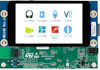

# Microcontrollers

## RP2040

|                                                              |                                                              | Notes                              |
| ------------------------------------------------------------ | ------------------------------------------------------------ | ---------------------------------- |
| Pico                                                         |  | Original                           |
| PicoW                                                        |  | Original plus WiFi BlueTooth  |
| [Seeed XIAO RP2040](https://core-electronics.com.au/seeed-xiao-rp2040-supports-arduino-micropython-and-circuitpython.html) |  | Limited number of pins but smaller |
|                                                              |                                                              |                                    |
|                                                              |                                                              |                                    |

## STM32

|                                                              |                                                              | Notes                 |     RTOS      |
| ------------------------------------------------------------ | ------------------------------------------------------------ | :-------------------- | :-----------: |
| [**STM32F769IDISCOVERY**](https://www.st.com/en/evaluation-tools/32f769idiscovery.html) |  | Cortex M7  216MHz |    Chibios    |
| **[STM32H735G-DK](https://www.st.com/en/evaluation-tools/stm32h735g-dk.html)** |  | Cortex M7  550MHz | Azure/Threadx |
| [**STM32H7B3I-DK**](https://www.st.com/en/evaluation-tools/stm32h7b3i-dk.html) |  | Cortex M7  280Mhz | Azure/Threadx |

## ESP32

