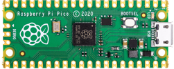
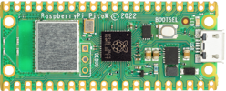
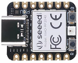
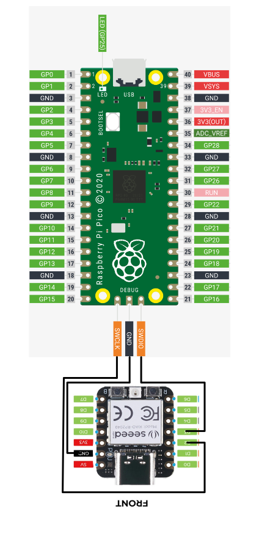

# RP2040

The Raspberry Pi Pico is a  high-performance microcontroller chip designed by Raspberry Pi in the United Kingdom

The Chip features 

- Dual-core Arm Cortex M0+ processor, flexible clock running up to 133 MHz
- 264kB of SRAM, and 2MB of on-board flash memory
- USB 1.1 with device and host support
- Low-power sleep and dormant modes
- Drag-and-drop programming using mass storage over USB
- 26 × multi-function GPIO pins
- 2 × SPI, 2 × I2C, 2 × UART, 3 × 12-bit ADC, 16 × controllable PWM channels
- Accurate clock and timer on-chip
- Temperature sensor
- Accelerated floating-point libraries on-chip
- 8 × Programmable I/O (PIO) state machines for custom peripheral support

## Boards based on the RP2040

|                                                              |                                                              | Notes                              |
| ------------------------------------------------------------ | ------------------------------------------------------------ | ---------------------------------- |
| Pico                                                         |  | Original                           |
| PicoW                                                        |  | Original plus WiFi BlueTooth  |
| [Seeed XIAO RP2040](https://core-electronics.com.au/seeed-xiao-rp2040-supports-arduino-micropython-and-circuitpython.html) |  | Limited number of pins but smaller |
|                                                              |                                                              |                                    |
|                                                              |                                                              |                                    |

# JTAG Debugging the RP2040

To allowing porting the nanoFramework to the RP2040, a native C/C++ debugging facility is required. ( *unless you can write perfect code*)

There a couple of ways to do this, the following describes the **PicoProbe** method.

## Creating a PicoProbe

