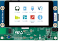
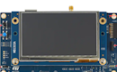
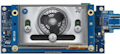

  

    Table of contents
  

  {: .no_toc .text-delta }
1. TOC
{:toc}

# STM32

|                                                              |                                                              |      | Notes                 |     RTOS      |
| ------------------------------------------------------------ | ------------------------------------------------------------ | ---- | :-------------------- | :-----------: |
| [**STM32F769IDISCOVERY**](https://www.st.com/en/evaluation-tools/32f769idiscovery.html) |  |      | Cortex M7  216MHz |    Chibios    |
| **[STM32H735G-DK](https://www.st.com/en/evaluation-tools/stm32h735g-dk.html)** |  |      | Cortex M7  550MHz | Azure/Threadx |
| [**STM32H7B3I-DK**](https://www.st.com/en/evaluation-tools/stm32h7b3i-dk.html) |  |      | Cortex M7  280Mhz | Azure/Threadx |

## STM32F769IDiscovery

This discovery board utilizes the STM32F769NIH6  Arm® Cortex®‑M7 core-based microcontroller with 2 MBytes of flash memory and 532 Kbytes of RAM.

- 4-inch 800 x 472‑pixel capacitive touch TFT color LCD with serial interface (on STM32F769I-DISCO only)
- Optional display accessories: HDMI and DSI adapters
- SAI audio codec
- Four digital ST MEMS microphones on DFSDM inputs
- 128‑Mbit SDRAM
- 512‑Mbit Quad-SPI flash memory
- Reset and user push-buttons

### Pin Outs

| CN9  | Pin  | Port | CONNECTOR Name |
| :--- | :--- | :--- | :------------: |
|      | 1    | PC0  |       A0       |
|      | 2    | PH2  |       A1       |
|      | 3    | PA0  |       A2       |
|      | 4    | PA1  |       A3       |
|      | 5    | PC2  |       A4       |
|      | 6    | PC3  |       A5       |

|         | PIN  | PORT | CONNECTOR Name |
| ------- | ---- | ---- | :------------: |
| **CN8** | 1    | PB15 |       D0       |
|         | 2    | PB14 |       D1       |
|         | 3    | PG3  |       D2       |
|         | 4    | PA0  |       D3       |
|         | 5    | PG4  |       D4       |
|         | 6    | PE14 |       D5       |
|         | 7    | PD15 |       D6       |
|         | 8    | PG5  |       D7       |

|         |      | CONNECTOR Name |
| ------- | :--: | :------------: |
| **CN5** |  1   |      E5V       |
|         |  2   |     IOREF      |
|         |  3   |      NRST      |
|         |  4   |      3V3       |
|         |  5   |       5V       |
|         |  6   |      GND       |
|         |  7   |      GND       |
|         |  8   |      VIN       |

|         |      |         | CONNECTOR Name |
| ------- | :--: | :-----: | :------------: |
| **CN4** |  1   |   PE3   |       D8       |
|         |  2   |   PB7   |       D9       |
|         |  3   |   PF6   |      D10       |
|         |  4   |   PF9   |      D11       |
|         |  5   |   PF8   |      D12       |
|         |  6   |   PF7   |      D13       |
|         |  7   |   GND   |                |
|         |  8   |  AVDD   |                |
|         |  9   | I2C_SDA |                |
|         |  10  | I2C_SCL |                |

|                   |      |      |      | CONNECTOR Name |
| :---------------: | :--: | ---- | :--: | :------------: |
| **Mikrobus-CN11** |  1   | AN   |  1   |      PWM       |
|                   |  2   | RST  |  2   |      INT       |
|                   |  3   | CS   |  3   |       RX       |
|                   |  4   | SCK  |  4   |       TX       |
|                   |  5   | MISO |  5   |      SCL       |
|                   |  6   | MOSI |  6   |      SDA       |
|                   |  7   | 3V3  |  7   |       5V       |
|                   |  8   | GND  |  8   |      GND       |

| Grove - CN3 |      |      |      |         |
| ----------- | :--: | :--: | :--: | :-----: |
| PF14        |  1   |      | SCL  | I2C_SCL |
| PF15        |  2   |      | SDA  | I2C_SDA |
|             |  3   | Vcc  |      |         |
|             |  4   | GND  |      |         |

| CN4  |      |      |      |
| ---- | :--: | :--: | :--: |
| PF7  |  1   |      |  RX  |
| PF9  |  2   |      |  TX  |
|      |  3   | Vcc  |      |
|      |  4   | GND  |      |

| Arduino                                 |      |      |                 |                           |      |
| --------------------------------------- | :--: | :--- | :-------------- | :------------------------ | ---- |
|                                         |      | D15  | SCL             | PF14 - I2C4_SCL           |      |
|                                         |      | D14  | SDA             | PF15 - I2C4_SDA           |      |
|                                         |      | AVDD | AVDD            |                           |      |
|                                         |      | GND  | GND             |                           |      |
| 5 Volts, 800ma                          | E5V  | D13  | SCK             | PF7 - SPI5_SCK            |      |
| connected to  3.3V                      | D12  | MISO | PF8 - SPI5_MISO |                           |      |
| MCU Reset                               | NRST | D11  | PWM/MOSI        | PF9 - TIM32_CH4,SPI5_MOSI |      |
| 3.3 Volts, 1.3 Amps                     | 3V3  | D10  | PWM/CS          | PF6 - TIM32_CH1,SPI5_NSS  |      |
| 5 Volt source from one of (E5V,USB,POE) |  5V  | D9   | PWM             | PB7 - TIM4_CH2            |      |
| Ground                                  | GND  | D8   |                 | PE3                       |      |
| Ground                                  | GND  |      |                 |                           |      |
| External Supply must be < 11.5 Volts    | VIN  | D7   |                 | PG5                       |      |
|                                         |      | D6   | PWM             | PD15 - TIM4_CH4           |      |
| PC0 - ADC123_INP10                      |  A0  | D5   | PWM             | PE14 - TIM1_CH4           |      |
| PH2 - ADC3_INP13                        |  A1  | D4   |                 | PG4                       |      |
| PA0_C ADC12_INP0                        |  A2  | D3   | PWM             | PA0 - TIM5_CH4            |      |
| PA1_C ADC12_INP1                        |  A3  | D2   |                 | PG3                       |      |
| PC2_C ADC3_INP0                         |  A4  | D1   | TX              | PB14 - USART1_TX          |      |
| PC3_C                                   |  A5  | D0   | RX              | PB15 - USART1_RX          |      |

**Figure 2**

### Azure-RTOS and startup

When the Azure-RTOS kernel is started, the first call is tx_initialize_low_level.s. The code does not have any specific STM32H7 code and appears to be CORTEX-M common ( to followup). This is where the SysTick frequency is setup as the base timer for the RTOS. There are two variables that define the frequency. SYSTEM_CLOCK = 520000000 <-- T*his value should be changed to match your CPU clock configuration* SYSTICK_CYCLES = ((SYSTEM_CLOCK / 100) -1) The value is setup, see Figure 2

 

 