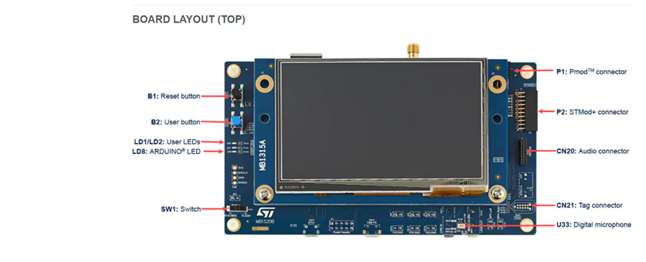
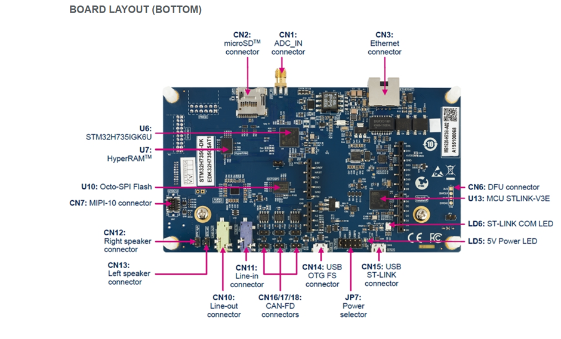
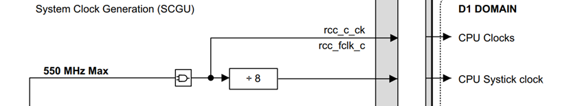
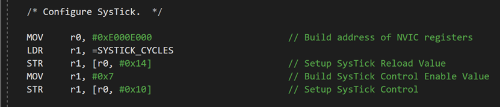

# STM32H735G-DK

### Pin Outs

| CN9  | 1    | PC0  | A0   |
| ---- | ---- | ---- | ---- |
|      | 2    | PH2  | A1   |
|      | 3    | PA0  | A2   |
|      | 4    | PA1  | A3   |
|      | 5    | PC2  | A4   |
|      | 6    | PC3  | A5   |

| CN8  | 1    | PB15 | D0   |
| ---- | ---- | ---- | ---- |
|      | 2    | PB14 | D1   |
|      | 3    | PG3  | D2   |
|      | 4    | PA0  | D3   |
|      | 5    | PG4  | D4   |
|      | 6    | PE14 | D5   |
|      | 7    | PD15 | D6   |
|      | 8    | PG5  | D7   |

| CN5  | 1    | E5V   |
| ---- | ---- | ----- |
|      | 2    | IOREF |
|      | 3    | NRST  |
|      | 4    | 3V3   |
|      | 5    | 5V    |
|      | 6    | GND   |
|      | 7    | GND   |
|      | 8    | VIN   |

| CN4  | 1    | PE3     | D8   |
| ---- | ---- | ------- | ---- |
|      | 2    | PB7     | D9   |
|      | 3    | PF6     | D10  |
|      | 4    | PF9     | D11  |
|      | 5    | PF8     | D12  |
|      | 6    | PF7     | D13  |
|      | 7    | GND     |      |
|      | 8    | AVDD    |      |
|      | 9    | I2C_SDA |      |
|      | 10   | I2C_SCL |      |

| Mikrobus-CN11 | 1    | AN   | 1    | PWM  |
| ------------- | ---- | ---- | ---- | ---- |
|               | 2    | RST  | 2    | INT  |
|               | 3    | CS   | 3    | RX   |
|               | 4    | SCK  | 4    | TX   |
|               | 5    | MISO | 5    | SCL  |
|               | 6    | MOSI | 6    | SDA  |
|               | 7    | 3V3  | 7    | 5V   |
|               | 8    | GND  | 8    | GND  |

| Grove - CN3 |      |      |      |         |
| ----------- | ---- | ---- | ---- | ------- |
| PF14        | 1    |      | SCL  | I2C_SCL |
| PF15        | 2    |      | SDA  | I2C_SDA |
|             | 3    | Vcc  |      |         |
|             | 4    | GND  |      |         |

| CN4  |      |      |      |
| ---- | ---- | ---- | ---- |
| PF7  | 1    |      | RX   |
| PF9  | 2    |      | TX   |
|      | 3    | Vcc  |      |
|      | 4    | GND  |      |

|                                         |      |      | ARDUINO         |                           |      |
| --------------------------------------- | ---- | ---- | --------------- | ------------------------- | ---- |
|                                         |      | D15  | SCL             | PF14 - I2C4_SCL           |      |
|                                         |      | D14  | SDA             | PF15 - I2C4_SDA           |      |
|                                         |      | AVDD | AVDD            |                           |      |
|                                         |      | GND  | GND             |                           |      |
| 5 Volts, 800ma                          | E5V  | D13  | SCK             | PF7 - SPI5_SCK            |      |
| connected to  3.3V                      | D12  | MISO | PF8 - SPI5_MISO |                           |      |
| MCU Reset                               | NRST | D11  | PWM/MOSI        | PF9 - TIM32_CH4,SPI5_MOSI |      |
| 3.3 Volts, 1.3 Amps                     | 3V3  | D10  | PWM/CS          | PF6 - TIM32_CH1,SPI5_NSS  |      |
| 5 Volt source from one of (E5V,USB,POE) | 5V   | D9   | PWM             | PB7 - TIM4_CH2            |      |
| Ground                                  | GND  | D8   |                 | PE3                       |      |
| Ground                                  | GND  |      |                 |                           |      |
| External Supply must be < 11.5 Volts    | VIN  | D7   |                 | PG5                       |      |
|                                         |      | D6   | PWM             | PD15 - TIM4_CH4           |      |
| PC0 - ADC123_INP10                      | A0   | D5   | PWM             | PE14 - TIM1_CH4           |      |
| PH2 - ADC3_INP13                        | A1   | D4   |                 | PG4                       |      |
| PA0_C ADC12_INP0                        | A2   | D3   | PWM             | PA0 - TIM5_CH4            |      |
| PA1_C ADC12_INP1                        | A3   | D2   |                 | PG3                       |      |
| PC2_C ADC3_INP0                         | A4   | D1   | TX              | PB14 - USART1_TX          |      |
| PC3_C                                   | A5   | D0   | RX              | PB15 - USART1_RX          |      |

 

nanoframework, native code, STM32H7xx and Azure-RTOS

DWT (data watch point and trace) counter re-use

During start up of peripherals, sometimes a short delay (in the order of microseconds) is required after writing t a register before continuing with further configuration. Although the SYSTICK can be used, in Azure-RTOS, the granularity is 10 milliseconds, which is a long time to wait if there are many registers to write and wait. In the arm Cortex there is also a DWT counter, the DWT is a debug unit that provides watchpoints and system profiling for the processor that is normally used for system debug and tracing. This is a specialised requirement and for this application this is not required and it is re-used to generate very short delays as required. DWT has a number of features and does depend on the processor, for the Cortex-M7 of the STM32H7 we will use the 32-bit register called CYCCNT, which is an up counter of the processor CPU clock cycles. By tracking the clock cycles, we can generate an accurate time delay given that the operating frequency of the CPU is known or can be known For the STMH735IG used on the STM735G-DK board, the CPU clock frequency is rated at 550MHz. The counter will increment every 1/550,000,000 ~ 1.9ns, and the counter is 32-bits giving a maximum delay of ~8.2 seconds. Since we are using this for very short delays, the counter feature of the DWT is great. 

Systick

 The STM32H7xx has an arm Coretex-M core processor. Each Cortex-M and some other Cortex cores have a standard 24 bit countdown timer with autoreload. The SysTick counter will countdown from its initial value, once it reaches zero it will raise an interrupt and a new count value will be loaded from the reload register. The main purpose of this timer is to generate a periodic interrupt for a real-time operating system (RTOS) or other event driven software. After the STM32H7xx is reset the SysTick registers are set to the following. **Address Name Type Reset Description** 0xE000E010 SYST_CSR RW 0x00000000 SysTick Control and Status Register 0xE000E014 SYST_RVR RW Unknown SysTick Reload Value Register 0xE000E018 SYST_CVR RW Unknown SysTick Current Value Register 0xE000E01C SYST_CALIB RO 0x3E8 SysTick Calibration Value Register The interrupt for the STM32H7 is in the NVIC table with the following properties Address : 0x0000 003CPriority : 6 The SysTick timer source clock by default is the CPU clock divided by 8, see Figure 1.

**Figure 1.**

 

**Figure 2**

Azure-RTOS and startup

When the Azure-RTOS kernel is started, the first call is tx_initialize_low_level.s. The code does not have any specific STM32H7 code and appears to be CORTEX-M common ( to followup). This is where the SysTick frequency is setup as the base timer for the RTOS. There are two variables that define the frequency. SYSTEM_CLOCK = 520000000 <-- T*his value should be changed to match your CPU clock configuration* SYSTICK_CYCLES = ((SYSTEM_CLOCK / 100) -1) The value is setup, see Figure 2

 

 